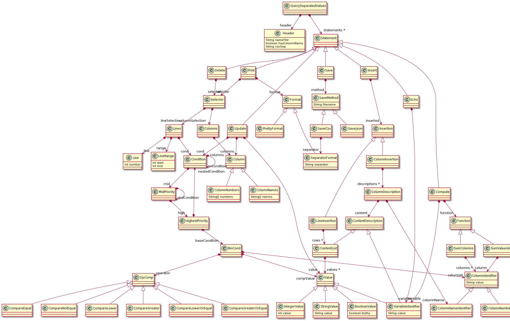
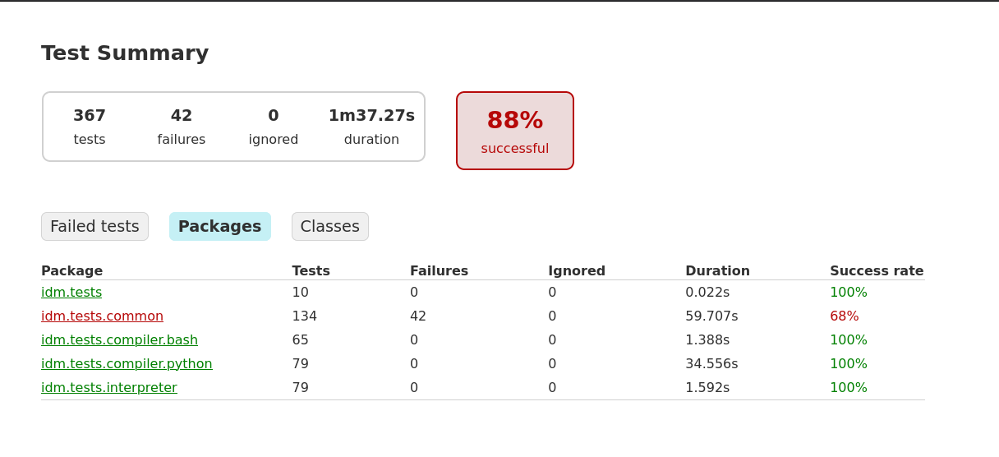

# Rapport IDM

Sigrid Droogh
Thomas Guzik

# Introduction

Ce projet a permis de développer un langage DSL s'appelant QSV, fusion des mots Query et CSV.   
Le but de ce langage est de manipuler des fichiers CSV et de leur faire des transformations.   
Ainsi parmi les fonctionnalités apportés par ce langage, nous avons :  
- Chargement des fichiers CSV
- Affichage des fichiers CSV, et sélection à l'aide d'expressions
- Fonctions sur des colonnes
- Insertion/modification/suppression des lignes et colonnes
- Export vers le JSON et sauvegarde en CSV

Deux compilateurs (Python et Bash) ont été créés, ainsi qu'un interpréteur en Xtend.  
Le compilateur Python utilise bibliothèque Pandas pour la manipulation de CSV.  
Le compilateur Bash utilise seulement des commandes Bash. Après un coup d'oeil à différentes bibliothèques Bash, nous nous sommes aperçus que celles-ci reposent sur du Python ou encore Rust. Nous nous sommes donc détournés de ces bibliothèques.  
L'interpréteur n'utilise pas de bibliothèque spécifique (n'ayant pas réussi à importer des bibliothèques avec Maven dans le projet Xtext).

# Pré-requis :

Java 11

Python :
- python 3.6+
- pandas 1.1.4

Bash :
- bash 4.4 avec les commandes :
- - break
- - echo
- - eval
- - if
- - for
- - printf
- - read
- - while
- - [[ ]]
- - $()
- - $(( ))
- bsdmainutils 11.1 incluant les commandes :
- - column
- coreutils 8.28 incluant les commandes :
- - cat
- - cut
- - head
- - paste
- - tr
- - tail
- - wc
- grep 3.1
- mawk 1.3.3
- - awk


# Lancer le projet

La branche sur laquelle on peut exécuter le projet dans Eclipse est `master`. Celle-ci est la version "maven".

La branche où on peut exécuter le projet avec Docker est `move-to-gradle`, pour la version "gradle" (nous n'avons pas réussi à exécuter le projet en ligne de commande avec maven).

Dans Eclipse : 

**Ouvrir le projet dans Eclipse**

*-> File : Open Projects from File System...*

Il peut y avoir des erreurs au premier import. Elles partent en générant la grammaire Xtext du DSL : dans le projet `idm.qsv`, package `src.idm`, clic droit puis *Run AS : Generate Xtext Artifacts* sur le fichier `Qsv.xtext`.

**Lancer les tests dans Eclipse**

Pour chaque classe de test, on peut lancer ses tests avec clic droit puis *Run As : JUnit Test*. Cela nécessite d'avoir les dépendances citées plus haut d'installées sur le système.


**Lancer les tests dans Docker**

```sh
docker build -t test-qsv -f Dockerfile.test .
docker run -it -v $PWD/tmp/:/home/gradle/idm.qsv.tests/build/ test-qsv
# pour aller voir le rapport
cd tmp/reports/tests/test/
python3 -m http.server
# puis naviguer vers l'endroit affiché
```


**Lancer un fichier Qsv avec Docker**

```sh
docker build -t qsv -f Dockerfile .
cd qsv-code/
# Lancer les trois versions
./run sh,py,int fichier.qsv
# Lancer seulement la version bash par exemple
./run sh fichier.qsv
```


# Syntaxe abstraite

Schéma de la syntaxe abstraite :



# Syntaxe concrète


## Entête

### Charger un fichier

Charger un fichier avec ses noms de colonnes :

`using "fichier.csv" with column names: yes`

Charger un fichier sans ses noms de colonnes :

`using "fichier.csv" with column names: no`

**Gestion du séparateur**

Par défault, le séparateur est ",", mais il peut être changé :

`using "fichier.csv" with column names: no :csvSeparator ";"`

## Instructions

### Afficher le tableur

Afficher le tableur :

`print`

Afficher une colonne en sélectionnant par son nom :

`print :columns col1`

*Note : l'index des colonnes commence à partir de 0*

Afficher une colonne en sélectionnant par son index :

`print :columns #1`

Afficher plusieurs colonnes :

`print :columns col1, col2, col3`

OU

`print :columns #0, #1, #2`

Afficher une ligne sélectionné :

`print :lines #1`

Afficher un groupe de ligne :

`print :lines #1-3`

Afficher des lignes selon une condition :

- Avec l'égalité arithmétique

`print :lines col0 = 1`

- Avec l'inégalité arithmétique

`print :lines col0 != 1`

- Avec la supériorité arithmétique

`print :lines col0 > 1`

- Avec l'infériorité arithmétique

`print :lines col0 < 1`

- Avec la supériorité et l'égalité arithmétique

`print :lines col0 >= 1`

- Avec l'infériorité et l'égalité arithmétique

`print :lines col0 <= 1`

- Avec l'égalité des string

`print :lines col0 = "Italie"`

- Avec l'inégalité des string

`print :lines col0 != "Italie"`

*Note: les booléens sont représentés par les mots clés `yes` et `no` pour vrai et faux**

- Avec l'égalité booléenne

`print :lines col0 = yes`

- Avec l'inégalité booléenne

`print :lines col0 != no`

*Note: la priorité des opérateurs est conservé, ainsi le `et` est prioritaire sur le `ou`*

- Avec l'opérateur et

`print :lines col1 = 0 and col3 = 0`

- Avec l'opérateur ou

`print :lines col1 = 0 or col3 = 0`

- Avec des parenthèses

`print :lines ( col1 = 1 or col2 = 4 ) and col1 = 8`


Afficher des lignes avec des conditions :

`print :lines #5 col1 > 3`

Afficher des lignes et des colonnes :

`print :lines #5 :columns #2`

OU

`print :columns #2 :lines #5`

Afficher des lignes avec des conditions et des colonnes :

`print :columns #2 :lines #5 col1 > 3`

OU 

`print :lines #5 col1 > 3 :columns #2`

Changer le séparateur par défaut à l'affichage :

`print :separator "-"`

Activer le pretty printing :

`print :pretty`

### Ajouter une colonne / une ligne

Ajouter une colonne :

`insert :columns ("f4","v4")`

Ajouter plusieurs colonnes :

`insert :columns ("f4","v4"), ("f5", "v5")`

Ajouter une ligne :

`insert :lines ("w1","w2","w3")`

Ajouter plusieurs lignes :

`insert :lines ("w1","w2","w3"),("y1","y2","y3")`

### Supprimer une colonne / une ligne

Supprimer une colonne en sélectionnant par son nom :

`delete :columns col1`

*Note : l'index des colonnes commence à partir de 0*

Supprimer une colonne en sélectionnant par son index :

`delete :columns #1`

Supprimer plusieurs colonnes :

`delete :columns col1, col2, col3`

OU

`delete :columns #0, #1, #2`

Supprimer toutes les colonnes :

`delete :columns`

Supprimer une ligne sélectionné :

`delete :lines #1`

Supprimer un groupe de ligne :

`delete :lines #1-3`

Supprimer des lignes selon une condition :

- Avec l'égalité arithmétique

`delete :lines col0 = 1`

- Avec l'inégalité arithmétique

`delete :lines col0 != 1`

- Avec la supériorité arithmétique

`delete :lines col0 > 1`

- Avec l'infériorité arithmétique

`delete :lines col0 < 1`

- Avec la supériorité et l'égalité arithmétique

`delete :lines col0 >= 1`

- Avec l'infériorité et l'égalité arithmétique

`delete :lines col0 <= 1`

- Avec l'égalité des string

`delete :lines col0 = "Italie"`

- Avec l'inégalité des string

`delete :lines col0 != "Italie"`

*Note: les booléens sont représentés par les mots clés `yes` et `no` pour vrai et faux**

- Avec l'égalité booléenne

`delete :lines col0 = yes`

- Avec l'inégalité booléenne

`delete :lines col0 != no`

*Note: la priorité des opérateurs est conservé, ainsi le `et` est prioritaire sur le `ou`*

- Avec l'opérateur et

`delete :lines col1 = 0 and col3 = 0`

- Avec l'opérateur ou

`delete :lines col1 = 0 or col3 = 0`

- Avec des parenthèses

`delete :lines ( col1 = 1 or col2 = 4 ) and col1 = 8`


Supprimer des lignes avec des conditions :

`delete :lines #5 col1 > 3`

Supprimer toutes les lignes :

`delete :lines`

Supprimer des lignes et des colonnes :

`delete :lines #5 :columns #2`

OU

`delete :columns #2 :lines #5`

Supprimer des lignes avec des conditions et des colonnes :

`delete :columns #2 :lines #5 col1 > 3`

OU 

`delete :lines #5 col1 > 3 :columns #2`

### Modifier une colonne

Modifier une colonne :

```
update
    :set 0
    :columns nb_habitants
    :condition nb_habitants < 0
```

`update :set "w" :columns #1`

*Note: On pourrait très bien utilisé le nom de la colonne*

Modifier une colonne et avec une condition :

`update :set "w" :columns #1 :condition #1 = "f2"`

### Fonction sur le tableur

Les fonctions font partie de la commande `compute`. Le résultat d'un fonction est placé dans une variable. Toutes les variables commencent par le signe `$`.

*Note: Si la colonne est une colonne de nombre, alors nous ferons la somme arithmétique, autrement nous ferons une concaténation*

Somme de toutes les valeurs dans des valeurs d'une colonne :

```
compute $totalGDP
    :sumValuesInColumn GDP
```

Somme de plusieurs colonnes, ligne à ligne. Retourne une colonne : (retourne une colonne)

```
compute $animalCount
    :sumColumns dogCount, horseCount, cowCount
```

### Utiliser des variables

Il est possible d'afficher la valeur d'une variable avec `echo`, ou de la réutiliser dans d'autres expressions : une sélection de lignes, une insertion ...

```
compute $dogsAndHumans
    :sumColumns dogCount, humanCount
echo $dogsAndHumans
```

```
compute $totalDogs
    :sumValuesInColumn dogCount
print
    :lines humanCount < $totalDogs
```

### Sauvegarder 

Sauvegarder en csv :

Dans le même fichier que celui importé
```
save
	:csv
```

Dans un autre fichier
```
save
	:csv "otherfile.csv"
```

Sauvegarder en json :

```
save
	:json
```
```
save
	:json "somefile.json"
```

### Utiliser plusieurs instructions

Chaque programme est composé de 2 parties : une entête et une suite d'instructions.  
Voici des exemples de programme :

```
using "foo_numbers.csv" with column names: yes
    compute $sumCol0
        :sumValuesInColumn col0
    update
        :set $sumCol0
        :columns col0
        :condition col0 = 1
    print
        :columns col1
        :lines col0 = $sumCol0
```

```
using "foo_numbers.csv" with column names: yes
    compute $sumCol0Col1
        :sumColumns col0, col1
    insert
        :columns newcol $sumCol0Col1
    print
```

## Grammaire

La grammaire est disponible dans le projet Xtext.


# Développement

Les compilateurs Bash et Python, et l'interpréteur ont été développés séparément.

Il y a des tests dans des packages séparés pour chaque compilateur et l'interpréteur. Ces tests vérifient que la sortie est celle attendue.

Tous les cas de tests ont également été dupliqués dans le package de test `common`. Ces tests vérifient si la sortie est exactement la même pour les trois types d'exécution, à l'espace près.

Voici le dernier état du projet :



On remarque que seuls les tests en commun ne passent pas tous. Cela est principalement dû à :

- des soucis d'espacements (tab/espaces) sur lesquels nous nous sommes mis d'accord relativement tard dans le projet
- pas forcément les mêmes fonctionnalités ont été implémentées dans les trois projets

