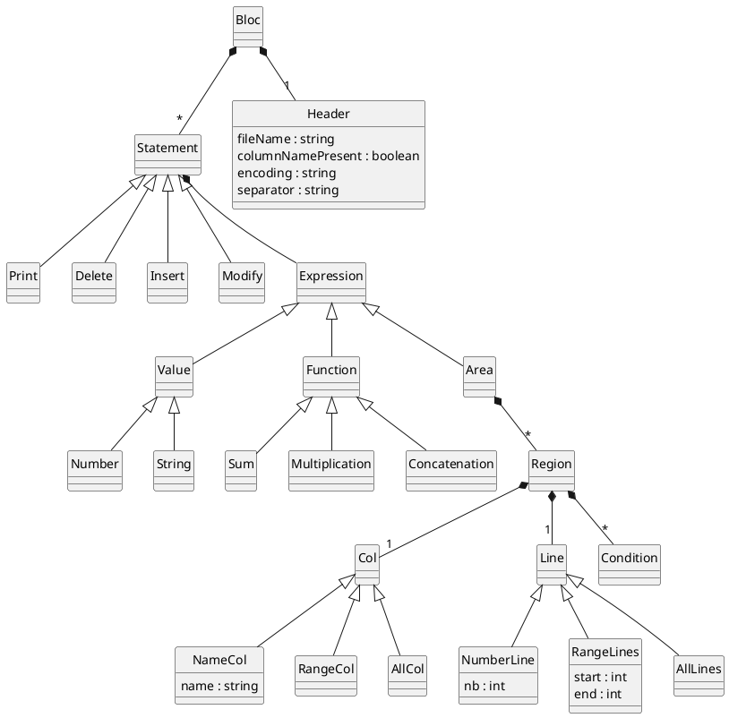

 # Visualiser le diagramme avec markdown preview enhancer

https://atom.io/packages/markdown-preview-enhanced

Taper dans le terminal :
apm install markdown-preview-enhanced
Puis redémarrez atom

# Diagramme

